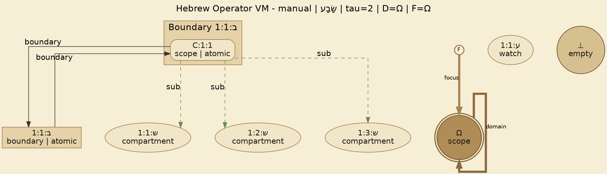
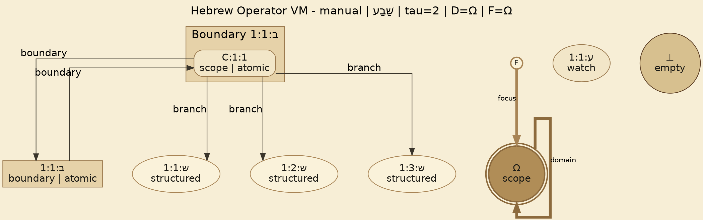

# Test Artifacts: שָׂבָע vs שָׁבָע

Test context: `tests/core/02_vm/shin-sin-sava-shava.test.ts`

## Textual Trace: שָׂבָע

```text
PASUK TRACE REPORT
ref: manual
cleaned: שָׂבָע

══════════════════════════════════════════════════════════════
 WORD 1 │ שָׂבָע │ incoming_D=Ω incoming_F=Ω │ outgoing_D=Ω outgoing_F=Ω │ exit_kind=cut │ exit=□hard
══════════════════════════════════════════════════════════════

  [join_in: -]

τ=1 │ OP_1  [sof:kamatz]  (שָׂ)
    │ Select : {"args":["C:1:1"],"prefs":{}}
    │ Rosh   : {"diacritics":[],"inside_dot_kind":"shin_dot_left","shin_branch":null}
    │ Bound  : {"base":"C:1:1","envelope":{"ctx_flow":"LOW","x_flow":"IMPLICIT_OK","data_flow":"LIVE","edit_flow":"OPEN","ports":[],"coupling":"LINK","policy":"soft"},"meta":{"focusId":"C:1:1","direction":"internal","spineId":"ש:1:1","leftId":"ש:1:2","rightId":"ש:1:3"}}
    │ Toch   : {"diacritics":[{"mark":"ׂ","kind":"shin_dot_left","tier":"toch"}],"dot_kind":"none","inside_dot_kind":"shin_dot_left","letter_mode":null}
    │ Seal   : {"sealed_handle":"C:1:1","residue":"⊥","F":"C:1:1","R":"⊥"}
    │ Sof    : [{"mark":"ָ","kind":"kamatz","tier":"sof"}]
    │ State  : {"KLength":3,"OStackLength":0,"barrier":null}

τ=1 │ OP_2  [sof:kamatz]  (בָ)
    │ Select : {"args":["C:1:1"],"prefs":{"selection_targets":["ש:1:1","ש:1:2","ש:1:3"]}}
    │ Rosh   : {"diacritics":[],"inside_dot_kind":"none","shin_branch":null}
    │ Bound  : {"base":"C:1:1","envelope":{"ctx_flow":"LOW","x_flow":"IMPLICIT_OK","data_flow":"LIVE","edit_flow":"OPEN","ports":[],"coupling":"LINK","policy":"soft"},"meta":{"boundaryId":"ב:1:1","anchor":"C:1:1","outside":"C:1:1","domainCarrier":0}}
    │ Toch   : {"diacritics":[],"dot_kind":"none","inside_dot_kind":"none","letter_mode":null}
    │ Seal   : {"sealed_handle":"ב:1:1","residue":"⊥","F":"ב:1:1","R":"⊥"}
    │ Sof    : [{"mark":"ָ","kind":"kamatz","tier":"sof"}]
    │ State  : {"KLength":4,"OStackLength":0,"barrier":null}

τ=1 │ OP_3  (ע)
    │ Select : {"args":["ב:1:1"],"prefs":{}}
    │ Rosh   : {"diacritics":[],"inside_dot_kind":"none","shin_branch":null}
    │ Bound  : {"base":"ב:1:1","envelope":{"ctx_flow":"LOW","x_flow":"IMPLICIT_OK","data_flow":"LIVE","edit_flow":"OPEN","ports":[],"coupling":"LINK","policy":"soft"},"meta":{"watchId":"ע:1:1","target":"ב:1:1"}}
    │ Toch   : {"diacritics":[],"dot_kind":"none","inside_dot_kind":"none","letter_mode":null}
    │ Seal   : {"sealed_handle":"ע:1:1","residue":"⊥","F":"ע:1:1","R":"⊥"}
    │ Sof    : []
    │ State  : {"KLength":4,"OStackLength":0,"barrier":null}

  ─── □hard ───────────────────────────────────────────────────
    │ τ 1 -> 2; continuation=false
    │ pending_join_created=-; pending_join_consumed=-
    │ barrier=-; events=[{"type":"BOUNDARY","tau":2,"data":{"mode":"hard","beforeFocus":"ע:1:1","afterFocus":"Ω","segmentIdBefore":1}}]

══════════════════════════════════════════════════════════════
 FINAL DUMP STATE
══════════════════════════════════════════════════════════════
 vm.D=Ω; vm.F=Ω; vm.OmegaId=Ω
{"boundaries":[{"anchor":1,"id":"ב:1:1","inside":"C:1:1","outside":"C:1:1","members":["C:1:1"]}],"carry":[],"cont":[],"handles":[{"anchor":1,"edge_mode":"committed","envelope":{"coupling":"LINK","ctx_flow":"LOW","data_flow":"LIVE","edit_flow":"OPEN","policy":"soft","ports":[],"x_flow":"IMPLICIT_OK"},"id":"C:1:1","kind":"scope","meta":{"atomic":1,"construct_role":"baseline","ephemeral":1,"fork_direction":"internal","fork_ports":["ש:1:1","ש:1:2","ש:1:3"],"owner":"word","payload":{},"sof_modifiers":[{"kind":"kamatz","mark":"ָ"}],"word_text":"שָׂבָע","scope_path":["ב:1:1"]},"policy":"soft"},{"anchor":0,"edge_mode":"free","envelope":{"coupling":"LINK","ctx_flow":"LOW","data_flow":"LIVE","edit_flow":"OPEN","policy":"soft","ports":[],"x_flow":"IMPLICIT_OK"},"id":"Ω","kind":"scope","meta":{"chunk_commit_boundary":1},"policy":"soft"},{"anchor":1,"edge_mode":"committed","envelope":{"coupling":"LINK","ctx_flow":"LOW","data_flow":"LIVE","edit_flow":"OPEN","policy":"soft","ports":[],"x_flow":"IMPLICIT_OK"},"id":"ב:1:1","kind":"boundary","meta":{"atomic":1,"domainCarrier":0,"inside":"C:1:1","openedBy":"ב","outside":"C:1:1","sof_modifiers":[{"kind":"kamatz","mark":"ָ"}]},"policy":"soft"},{"anchor":0,"edge_mode":"free","envelope":{"coupling":"LINK","ctx_flow":"LOW","data_flow":"LIVE","edit_flow":"OPEN","policy":"soft","ports":[],"x_flow":"IMPLICIT_OK"},"id":"ע:1:1","kind":"watch","meta":{"chunk_commit_boundary":1,"target":"ב:1:1"},"policy":"soft"},{"anchor":0,"edge_mode":"free","envelope":{"coupling":"LINK","ctx_flow":"LOW","data_flow":"LIVE","edit_flow":"OPEN","policy":"soft","ports":[],"x_flow":"IMPLICIT_OK"},"id":"ש:1:1","kind":"compartment","meta":{"fork_direction":"internal","parent":"C:1:1","role":"c1"},"policy":"soft"},{"anchor":0,"edge_mode":"free","envelope":{"coupling":"LINK","ctx_flow":"LOW","data_flow":"LIVE","edit_flow":"OPEN","policy":"soft","ports":[],"x_flow":"IMPLICIT_OK"},"id":"ש:1:2","kind":"compartment","meta":{"fork_direction":"internal","parent":"C:1:1","role":"c2"},"policy":"soft"},{"anchor":0,"edge_mode":"free","envelope":{"coupling":"LINK","ctx_flow":"LOW","data_flow":"LIVE","edit_flow":"OPEN","policy":"soft","ports":[],"x_flow":"IMPLICIT_OK"},"id":"ש:1:3","kind":"compartment","meta":{"fork_direction":"internal","parent":"C:1:1","role":"c3"},"policy":"soft"},{"anchor":0,"edge_mode":"free","envelope":{"coupling":"LINK","ctx_flow":"LOW","data_flow":"LIVE","edit_flow":"OPEN","policy":"soft","ports":[],"x_flow":"IMPLICIT_OK"},"id":"⊥","kind":"empty","meta":{},"policy":"soft"}],"links":[{"from":"C:1:1","label":"boundary","to":"ב:1:1"},{"from":"ב:1:1","label":"boundary","to":"C:1:1"}],"rules":[],"sub":["C:1:1->ש:1:1","C:1:1->ש:1:2","C:1:1->ש:1:3"],"supp":[],"vm":{"A":["⊥","ע:1:1"],"D":"Ω","E":[{"D_frame":"Ω","F":"C:1:1","lambda":"class"}],"F":"Ω","H":[{"data":{"afterFocus":"Ω","beforeFocus":"Ω","mode":"hard","segmentIdBefore":0},"tau":1,"type":"BOUNDARY"},{"data":{"C0":"C:1:1","F0":"Ω","activeConstruct":"C:1:1","aliasReachableForward":true,"aliasReachableReverse":true,"focus":"C:1:1","hasAliasForward":true,"hasAliasReverse":true,"inboundFocus":"Ω","prevBoundaryMode":"hard","segmentId":1,"segmentIdAfter":1,"segmentOStackLength":0,"segmentReset":true,"wordText":"שָׂבָע"},"tau":1,"type":"WORD_START"},{"data":{"direction":"internal","focus":"C:1:1","id":"C:1:1","left":"ש:1:2","right":"ש:1:3","spine":"ש:1:1"},"tau":1,"type":"shin"},{"data":{"anchor":1,"boundaryId":"ב:1:1","domainCarrier":0,"id":"ב:1:1","inside":"C:1:1","outside":"C:1:1"},"tau":1,"type":"boundary_open"},{"data":{"afterFocus":"Ω","beforeFocus":"ע:1:1","mode":"hard","segmentIdBefore":1},"tau":2,"type":"BOUNDARY"}],"K":["Ω","⊥"],"OStack_word":[],"R":"⊥","W":["ע:1:1"],"metaCounter":{"C":1,"ב":1,"ע":1,"ש":3},"tau":2,"has_data_payload":false,"OmegaId":"Ω"}}

══════════════════════════════════════════════════════════════
 POST-RESET RUNTIME STATE
══════════════════════════════════════════════════════════════
 vm.D=Ω; vm.F=Ω; vm.OmegaId=Ω
{"vm":{"tau":0,"D":"Ω","F":"Ω","R":"⊥","K":["Ω","⊥"],"E":[],"W":[],"OStack_word":[],"H":[],"A":[],"has_data_payload":false,"OmegaId":"Ω"},"handles":[{"id":"⊥","kind":"empty","policy":"soft","anchor":0,"edge_mode":"free","envelope":{"ctx_flow":"LOW","x_flow":"IMPLICIT_OK","data_flow":"LIVE","edit_flow":"OPEN","ports":[],"coupling":"LINK","policy":"soft"},"meta":{}},{"id":"Ω","kind":"scope","policy":"soft","anchor":0,"edge_mode":"free","envelope":{"ctx_flow":"LOW","x_flow":"IMPLICIT_OK","data_flow":"LIVE","edit_flow":"OPEN","ports":[],"coupling":"LINK","policy":"soft"},"meta":{}}],"cont":[],"carry":[],"supp":[],"sub":[],"links":[],"boundaries":[],"rules":[]}

```

## Textual Trace: שָׁבָע

```text
PASUK TRACE REPORT
ref: manual
cleaned: שָׁבָע

══════════════════════════════════════════════════════════════
 WORD 1 │ שָׁבָע │ incoming_D=Ω incoming_F=Ω │ outgoing_D=Ω outgoing_F=Ω │ exit_kind=cut │ exit=□hard
══════════════════════════════════════════════════════════════

  [join_in: -]

τ=1 │ OP_1  [sof:kamatz]  (שָׁ)
    │ Select : {"args":["C:1:1"],"prefs":{}}
    │ Rosh   : {"diacritics":[],"inside_dot_kind":"shin_dot_right","shin_branch":null}
    │ Bound  : {"base":"C:1:1","envelope":{"ctx_flow":"LOW","x_flow":"IMPLICIT_OK","data_flow":"LIVE","edit_flow":"OPEN","ports":[],"coupling":"LINK","policy":"soft"},"meta":{"focusId":"C:1:1","direction":"external","spineId":"ש:1:1","leftId":"ש:1:2","rightId":"ש:1:3"}}
    │ Toch   : {"diacritics":[{"mark":"ׁ","kind":"shin_dot_right","tier":"toch"}],"dot_kind":"none","inside_dot_kind":"shin_dot_right","letter_mode":null}
    │ Seal   : {"sealed_handle":"C:1:1","residue":"⊥","F":"C:1:1","R":"⊥"}
    │ Sof    : [{"mark":"ָ","kind":"kamatz","tier":"sof"}]
    │ State  : {"KLength":3,"OStackLength":0,"barrier":null}

τ=1 │ OP_2  [sof:kamatz]  (בָ)
    │ Select : {"args":["C:1:1"],"prefs":{}}
    │ Rosh   : {"diacritics":[],"inside_dot_kind":"none","shin_branch":null}
    │ Bound  : {"base":"C:1:1","envelope":{"ctx_flow":"LOW","x_flow":"IMPLICIT_OK","data_flow":"LIVE","edit_flow":"OPEN","ports":[],"coupling":"LINK","policy":"soft"},"meta":{"boundaryId":"ב:1:1","anchor":"C:1:1","outside":"C:1:1","domainCarrier":0}}
    │ Toch   : {"diacritics":[],"dot_kind":"none","inside_dot_kind":"none","letter_mode":null}
    │ Seal   : {"sealed_handle":"ב:1:1","residue":"⊥","F":"ב:1:1","R":"⊥"}
    │ Sof    : [{"mark":"ָ","kind":"kamatz","tier":"sof"}]
    │ State  : {"KLength":4,"OStackLength":0,"barrier":null}

τ=1 │ OP_3  (ע)
    │ Select : {"args":["ב:1:1"],"prefs":{}}
    │ Rosh   : {"diacritics":[],"inside_dot_kind":"none","shin_branch":null}
    │ Bound  : {"base":"ב:1:1","envelope":{"ctx_flow":"LOW","x_flow":"IMPLICIT_OK","data_flow":"LIVE","edit_flow":"OPEN","ports":[],"coupling":"LINK","policy":"soft"},"meta":{"watchId":"ע:1:1","target":"ב:1:1"}}
    │ Toch   : {"diacritics":[],"dot_kind":"none","inside_dot_kind":"none","letter_mode":null}
    │ Seal   : {"sealed_handle":"ע:1:1","residue":"⊥","F":"ע:1:1","R":"⊥"}
    │ Sof    : []
    │ State  : {"KLength":4,"OStackLength":0,"barrier":null}

  ─── □hard ───────────────────────────────────────────────────
    │ τ 1 -> 2; continuation=false
    │ pending_join_created=-; pending_join_consumed=-
    │ barrier=-; events=[{"type":"BOUNDARY","tau":2,"data":{"mode":"hard","beforeFocus":"ע:1:1","afterFocus":"Ω","segmentIdBefore":1}}]

══════════════════════════════════════════════════════════════
 FINAL DUMP STATE
══════════════════════════════════════════════════════════════
 vm.D=Ω; vm.F=Ω; vm.OmegaId=Ω
{"boundaries":[{"anchor":1,"id":"ב:1:1","inside":"C:1:1","outside":"C:1:1","members":["C:1:1"]}],"carry":[],"cont":["C:1:1->ש:1:1","C:1:1->ש:1:2","C:1:1->ש:1:3"],"handles":[{"anchor":1,"edge_mode":"committed","envelope":{"coupling":"LINK","ctx_flow":"LOW","data_flow":"LIVE","edit_flow":"OPEN","policy":"soft","ports":[],"x_flow":"IMPLICIT_OK"},"id":"C:1:1","kind":"scope","meta":{"atomic":1,"construct_role":"baseline","ephemeral":1,"fork_direction":"external","fork_ports":["ש:1:1","ש:1:2","ש:1:3"],"owner":"word","payload":{},"sof_modifiers":[{"kind":"kamatz","mark":"ָ"}],"word_text":"שָׁבָע","scope_path":["ב:1:1"]},"policy":"soft"},{"anchor":0,"edge_mode":"free","envelope":{"coupling":"LINK","ctx_flow":"LOW","data_flow":"LIVE","edit_flow":"OPEN","policy":"soft","ports":[],"x_flow":"IMPLICIT_OK"},"id":"Ω","kind":"scope","meta":{"chunk_commit_boundary":1},"policy":"soft"},{"anchor":1,"edge_mode":"committed","envelope":{"coupling":"LINK","ctx_flow":"LOW","data_flow":"LIVE","edit_flow":"OPEN","policy":"soft","ports":[],"x_flow":"IMPLICIT_OK"},"id":"ב:1:1","kind":"boundary","meta":{"atomic":1,"domainCarrier":0,"inside":"C:1:1","openedBy":"ב","outside":"C:1:1","sof_modifiers":[{"kind":"kamatz","mark":"ָ"}]},"policy":"soft"},{"anchor":0,"edge_mode":"free","envelope":{"coupling":"LINK","ctx_flow":"LOW","data_flow":"LIVE","edit_flow":"OPEN","policy":"soft","ports":[],"x_flow":"IMPLICIT_OK"},"id":"ע:1:1","kind":"watch","meta":{"chunk_commit_boundary":1,"target":"ב:1:1"},"policy":"soft"},{"anchor":0,"edge_mode":"free","envelope":{"coupling":"LINK","ctx_flow":"LOW","data_flow":"LIVE","edit_flow":"OPEN","policy":"soft","ports":[],"x_flow":"IMPLICIT_OK"},"id":"ש:1:1","kind":"structured","meta":{"fork_direction":"external","parent":"C:1:1","role":"spine"},"policy":"soft"},{"anchor":0,"edge_mode":"free","envelope":{"coupling":"LINK","ctx_flow":"LOW","data_flow":"LIVE","edit_flow":"OPEN","policy":"soft","ports":[],"x_flow":"IMPLICIT_OK"},"id":"ש:1:2","kind":"structured","meta":{"fork_direction":"external","parent":"C:1:1","role":"left"},"policy":"soft"},{"anchor":0,"edge_mode":"free","envelope":{"coupling":"LINK","ctx_flow":"LOW","data_flow":"LIVE","edit_flow":"OPEN","policy":"soft","ports":[],"x_flow":"IMPLICIT_OK"},"id":"ש:1:3","kind":"structured","meta":{"fork_direction":"external","parent":"C:1:1","role":"right"},"policy":"soft"},{"anchor":0,"edge_mode":"free","envelope":{"coupling":"LINK","ctx_flow":"LOW","data_flow":"LIVE","edit_flow":"OPEN","policy":"soft","ports":[],"x_flow":"IMPLICIT_OK"},"id":"⊥","kind":"empty","meta":{},"policy":"soft"}],"links":[{"from":"C:1:1","label":"boundary","to":"ב:1:1"},{"from":"C:1:1","label":"branch","to":"ש:1:1"},{"from":"C:1:1","label":"branch","to":"ש:1:2"},{"from":"C:1:1","label":"branch","to":"ש:1:3"},{"from":"ב:1:1","label":"boundary","to":"C:1:1"}],"rules":[],"sub":[],"supp":[],"vm":{"A":["⊥","ע:1:1"],"D":"Ω","E":[{"D_frame":"Ω","F":"C:1:1","lambda":"class"}],"F":"Ω","H":[{"data":{"afterFocus":"Ω","beforeFocus":"Ω","mode":"hard","segmentIdBefore":0},"tau":1,"type":"BOUNDARY"},{"data":{"C0":"C:1:1","F0":"Ω","activeConstruct":"C:1:1","aliasReachableForward":true,"aliasReachableReverse":true,"focus":"C:1:1","hasAliasForward":true,"hasAliasReverse":true,"inboundFocus":"Ω","prevBoundaryMode":"hard","segmentId":1,"segmentIdAfter":1,"segmentOStackLength":0,"segmentReset":true,"wordText":"שָׁבָע"},"tau":1,"type":"WORD_START"},{"data":{"direction":"external","focus":"C:1:1","id":"C:1:1","left":"ש:1:2","right":"ש:1:3","spine":"ש:1:1"},"tau":1,"type":"shin"},{"data":{"anchor":1,"boundaryId":"ב:1:1","domainCarrier":0,"id":"ב:1:1","inside":"C:1:1","outside":"C:1:1"},"tau":1,"type":"boundary_open"},{"data":{"afterFocus":"Ω","beforeFocus":"ע:1:1","mode":"hard","segmentIdBefore":1},"tau":2,"type":"BOUNDARY"}],"K":["Ω","⊥"],"OStack_word":[],"R":"⊥","W":["ע:1:1"],"metaCounter":{"C":1,"ב":1,"ע":1,"ש":3},"tau":2,"has_data_payload":false,"OmegaId":"Ω"}}

══════════════════════════════════════════════════════════════
 POST-RESET RUNTIME STATE
══════════════════════════════════════════════════════════════
 vm.D=Ω; vm.F=Ω; vm.OmegaId=Ω
{"vm":{"tau":0,"D":"Ω","F":"Ω","R":"⊥","K":["Ω","⊥"],"E":[],"W":[],"OStack_word":[],"H":[],"A":[],"has_data_payload":false,"OmegaId":"Ω"},"handles":[{"id":"⊥","kind":"empty","policy":"soft","anchor":0,"edge_mode":"free","envelope":{"ctx_flow":"LOW","x_flow":"IMPLICIT_OK","data_flow":"LIVE","edit_flow":"OPEN","ports":[],"coupling":"LINK","policy":"soft"},"meta":{}},{"id":"Ω","kind":"scope","policy":"soft","anchor":0,"edge_mode":"free","envelope":{"ctx_flow":"LOW","x_flow":"IMPLICIT_OK","data_flow":"LIVE","edit_flow":"OPEN","ports":[],"coupling":"LINK","policy":"soft"},"meta":{}}],"cont":[],"carry":[],"supp":[],"sub":[],"links":[],"boundaries":[],"rules":[]}

```

## DOT Graph: שָׂבָע



## DOT Graph: שָׁבָע


